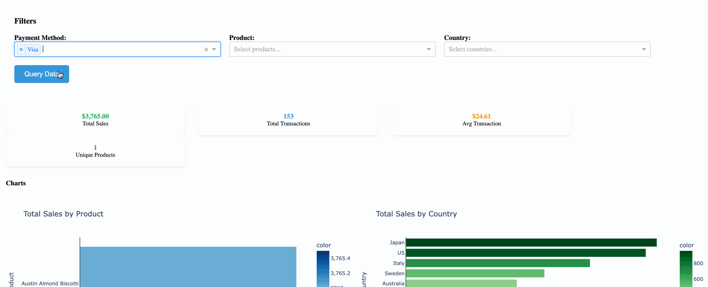

# Fast Cache with Dash and DuckDB 📊

Blog post [here](https://www.marshallpk.com/post/cache-duck-dash/).

Memoization is a technique used to speed up computer programs by storing the results of expensive function calls and returning the cached result when the same inputs occur again.

This is a basic Dash web application that demonstrates **in-memory caching** of Databricks SQL queries on the **bakehouse schema** using DuckDB. 



## 🚀 Quick Start

Make sure you have a virtual environment with uv installed.

1. **Install dependencies:**
```bash
make install
```

2. **Set up Databricks credentials:**
```bash
export DATABRICKS_HOST="your-databricks-workspace-url"
export DATABRICKS_WAREHOUSE_ID="your-warehouse-id"
```

3. **Run the app:**
```bash
python app.py
```

4. **Open dashboard:** http://localhost:8050

## 🎯 What It Does

- **Interactive filters** for payment method, product, and country
- **Real-time queries** to Databricks SQL (bakehouse schema)
- **Smart caching** using DuckDB in-memory storage with hash-based cache keys

## 🏗️ Architecture

- **Dash** for the web interface
- **DuckDB** for in-memory caching
- **Databricks SQL** for data source

## 🛠️ Development

```bash
make install-dev  # Install dev tools
make lint         # Run linting
```

## 📁 Source Files

- `src/app.py` - Main Dash application
- `src/db_helpers.py` - Databricks connection & caching
- `src/visualizations.py` - Chart & table components

## 🚢 Deploy on Databricks

Deploy your app to Databricks using the CLI:

Set your environment variables in a `.env` file or export them directly:

```bash
# Create a new Databricks App
databricks apps create $APP_NAME

# Sync your local code to Databricks workspace
databricks sync . $APP_WORKSPACE_PATH

# Deploy the app from your workspace folder
databricks apps deploy $APP_NAME --source-code-path $APP_WORKSPACE_PATH
```

Or use Databricks Asset Bundles for environment-specific deployments:

```bash
# Deploy to development environment
databricks bundle deploy --target dev

# Run the app
databricks bundle run dash-with-cache
```

## 📦 CI/CD

- Github Actions are used to run tests and deploy the app to Databricks.
- Databricks Asset Bundles are used to deploy the app to Databricks.

## 🌍 Reproducing in Another Environment

- Fork the repo
- Replace the datawarehouse id and databricks host in the databricks.yml file with the id of the datawarehouse you want to use.
- `databricks bundle deploy`
- `databricks bundle run dash-with-cache`

If you want the github actions stuff, do the following:
- Follow the steps in Apps cookbook to create a service principal and add the host, client id and secret to your github repo: https://apps-cookbook.dev/blog/automate-apps-deployments-dabs#preparing-your-service-principal
- Pushed changes will trigger tests suite to run
- On the github UI, create a release to trigger the pipeline to deploy the app to Databricks

## 📚 Credits

- Soumil Shah's implementation of a Postgres Query Cache with DuckDB: https://github.com/soumilshah1995/PostgresQueryCache-DuckDB/tree/main
- Pascal Vogel and Antonio Samaniego Jurado's blog post on automating app deployments to Databricks: https://apps-cookbook.dev/blog/automate-apps-deployments-dabs
